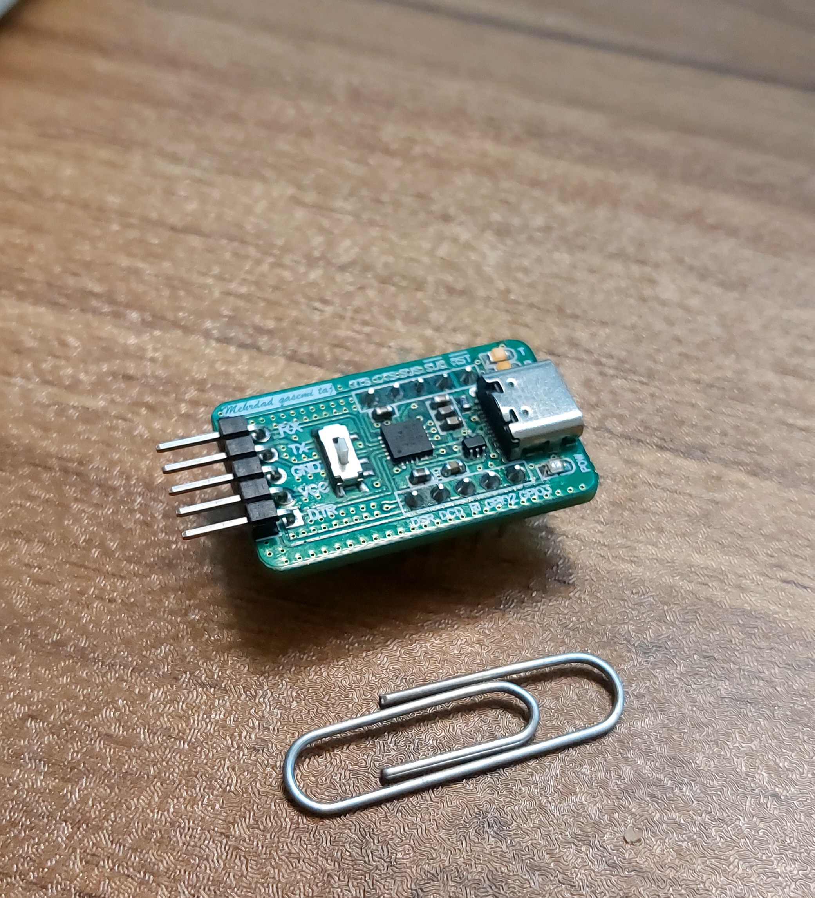

# USB to Serial Converter with CP2104

This project is a compact and reliable USB-to-Serial converter based on the **CP2104** chip. It is designed for seamless communication between your computer and microcontroller-based systems.

## Features

- ✅ **Small and compact form factor**
- 🔌 **USB Type-C connector** for modern and reversible USB connection
- 📌 **Standard 2.54mm pin headers**, fully breadboard-friendly
- 🔁 **Selectable VCC output**: toggle between **3.3V** and **5V** using an onboard switch
- 🔧 **All serial pins (TX, RX, GND, VCC)** are easily accessible
- 💡 Ideal for prototyping, debugging, and development with Arduino, ESP32, STM32, and more

## Specifications

| Feature        | Details                         |
|----------------|----------------------------------|
| USB Interface  | USB Type-C                      |
| IC             | CP2104                          |
| Voltage Output | 3.3V / 5V (switch selectable)   |
| Pin Headers    | 2.54mm (breadboard compatible)  |
| Size           | Compact, fits on standard breadboards |

## Usage

1. Plug the board into your PC via the USB Type-C connector.
2. Install the CP210x driver if needed ([Silicon Labs driver](https://www.silabs.com/developers/usb-to-uart-bridge-vcp-drivers)).
3. Use the onboard switch to select desired VCC output voltage (3.3V or 5V).
4. Connect TX, RX, GND, and VCC pins to your target device.

## Applications

- Serial communication with microcontrollers
- Firmware flashing
- Embedded system debugging
- USB-to-UART bridging

## License

This project is released under the [MIT License](LICENSE).

## Author

Developed by [Mehrdad Qasemi Taj](https://github.com/Mehrdad-QasemiTaj)

---

